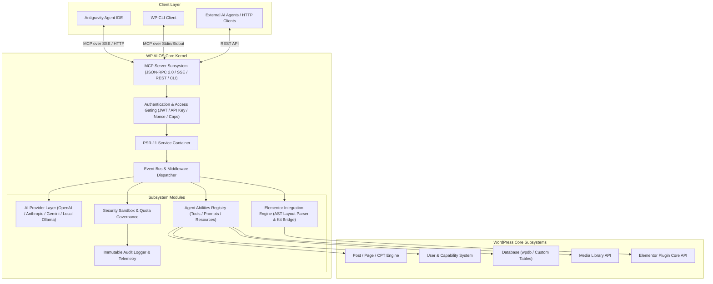
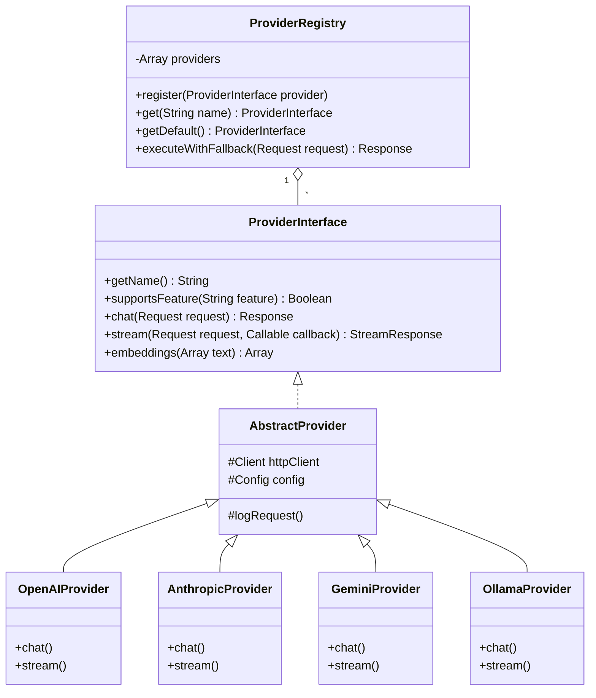
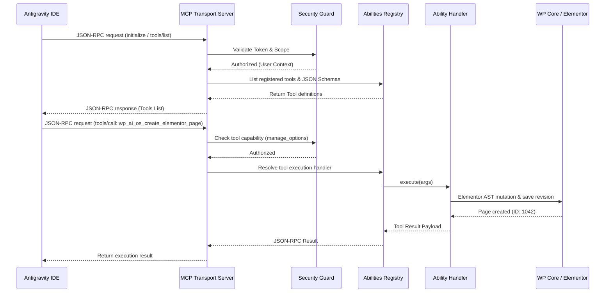
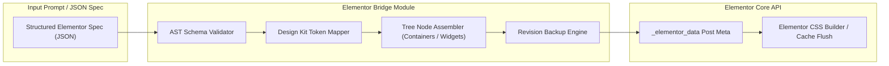

# System Architecture Document

## Project: WP AI OS (WordPress AI Operating System)
**Namespace:** `WPAIOS\`  
**Target Runtime:** PHP 8.2+ | WordPress 6.4+ | Composer 2.x  

---

## 1. Architectural Blueprint & System Context

WP AI OS is designed as a decoupled, event-driven, modular kernel operating within the WordPress plugin architecture. It bridges external AI systems (such as **Antigravity Agent IDE**) with WordPress internal APIs using the **Model Context Protocol (MCP)**.



---

## 2. Modular Subsystem Decomposition

The codebase is organized under PSR-4 namespace `WPAIOS\` into independent, loosely-coupled modules managed by a central Service Container (`WPAIOS\Core\Container`).

### 2.1 Core Kernel (`WPAIOS\Core`)
* **`Kernel`**: Manages plugin boot process, lifecycle hooks, and dependency registration.
* **`Container`**: Lightweight PSR-11 compliant dependency injection container supporting service instantiation, singleton bindings, and lazy loading.
* **`EventDispatcher`**: Publishes internal events (`wp_ai_os.ability_registered`, `wp_ai_os.tool_executing`, `wp_ai_os.tool_executed`) allowing third-party extendability.

### 2.2 AI Provider Layer (`WPAIOS\Providers`)
Provides an extensible abstraction over multiple LLM backends.



#### Key Architecture Principles:
- **Unified Request/Response Models:** Standardized `WPAIOS\Providers\Models\Request` and `WPAIOS\Providers\Models\Response` objects to prevent vendor lock-in.
- **Tool Call Normalization:** Normalizes tool call structures across OpenAI (Function Calling), Anthropic (Tools), Gemini (FunctionDeclarations), and Ollama into standard `WPAIOS\Providers\Models\ToolCall` objects.
- **Failover Strategy:** Automatic circuit-breaking and fallback execution chain (`Primary Provider` -> `Fallback Provider 1` -> `Fallback Provider 2`).

---

### 2.3 Model Context Protocol (MCP) Engine (`WPAIOS\Mcp`)

The MCP Engine converts WordPress into an MCP-compliant Server.



#### MCP Server Features:
- **Transports Supported:**
  1. **Server-Sent Events (SSE):** For long-lived streaming tool execution with web applications.
  2. **HTTP POST Endpoint (`/wp-json/wp-ai-os/v1/mcp`):** Standard REST JSON-RPC 2.0 payload handler.
  3. **WP-CLI (`wp ai-os mcp-server`):** Direct stdin/stdout JSON-RPC pipe for local agent processes.
- **MCP Protocols Handled:**
  - `initialize`: Client handshake and capability negotiation.
  - `tools/list`: Dynamic discovery of all active WordPress agent abilities with strict JSON schemas.
  - `tools/call`: Controlled execution of WordPress tools.
  - `resources/list` & `resources/read`: Inspect post types, database schemas, site settings as static/dynamic resources.
  - `prompts/list` & `prompts/get`: Built-in system prompt templates (e.g., Elementor composition assistant, WP code generation rules).

---

### 2.4 Agent Abilities Registry (`WPAIOS\Abilities`)

Every action executable by an AI agent is defined as an **Ability**. An Ability consists of:
1. **Metadata:** Name, description, version, module owner.
2. **Schema:** JSON Schema defining expected input arguments.
3. **Security Policy:** Required WordPress capabilities (e.g., `edit_posts`, `manage_options`).
4. **Execution Callback:** PHP class method responsible for execution.

#### Core Built-in Ability Domains:
* `ContentAbility`: `get_posts`, `create_post`, `update_post`, `delete_post`, `manage_terms`.
* `MediaAbility`: `upload_media`, `inspect_attachment`, `attach_to_post`.
* `UserAbility`: `list_users`, `check_permissions`, `create_user_draft`.
* `DatabaseAbility`: `inspect_tables`, `safe_select_query` (Read-only by default).
* `SystemAbility`: `get_site_info`, `get_cron_jobs`, `list_plugins`, `check_health`.
* `ElementorAbility`: `inspect_layout`, `create_container_page`, `update_widget_style`, `apply_kit_colors`.

---

### 2.5 Elementor Integration Engine (`WPAIOS\Elementor`)

Elementor stores layout data as structured JSON arrays representing an Abstract Syntax Tree (AST) in post meta key `_elementor_data`. Modifying raw HTML or strings leads to site breakage. WP AI OS uses a dedicated AST builder & validator.



#### Elementor Engine Capabilities:
1. **Flexbox Container First:** Native generation of modern Elementor Flexbox Containers and Grid layouts.
2. **Kit Token Resolution:** Automatically maps color and typography requests to site global kit settings (e.g., `var(--e-global-color-primary)` instead of hardcoded hex values).
3. **Atomic Widget Builders:** Strongly-typed PHP builders for core widgets: `HeadingWidget`, `TextEditorWidget`, `ButtonWidget`, `ImageWidget`, `IconBoxWidget`, `ContainerWidget`.
4. **Safety Snapshotting:** Automatically triggers WordPress `wp_save_post_revision()` before applying updates, enabling instant 1-click restore.

---

### 2.6 Security, Governance & Audit Layer (`WPAIOS\Security`)

Security is built into every layer of WP AI OS using defensive depth principles:

```
[ Incoming Request ]
        │
        ▼
┌─────────────────────────────────────────┐
│ 1. Transport Auth (JWT / Application    │
│    Password / Nonce Verification)       │
└─────────────────────────────────────────┘
        │
        ▼
┌─────────────────────────────────────────┐
│ 2. Parameter Sanitization & Injection   │
│    Defense (JSON Schema Validation)     │
└─────────────────────────────────────────┘
        │
        ▼
┌─────────────────────────────────────────┐
│ 3. User Capability Gating               │
│    (current_user_can($required_cap))    │
└─────────────────────────────────────────┘
        │
        ▼
┌─────────────────────────────────────────┐
│ 4. Rate Limiting & Quota Manager        │
│    (Token Budget & Frequency Limit)     │
└─────────────────────────────────────────┘
        │
        ▼
┌─────────────────────────────────────────┐
│ 5. Sandbox Policy Check                 │
│    (Destructive Actions dry-run check)  │
└─────────────────────────────────────────┘
        │
        ▼
┌─────────────────────────────────────────┐
│ 6. Execution & Immutable Audit Log      │
│    (Database table: wp_ai_os_audit_log) │
└─────────────────────────────────────────┘
```

#### Security Policies:
- **Zero Raw Code Execution:** No arbitrary `eval()` or unsanitized dynamic PHP code execution.
- **SQL Protection:** Database access restricted to `wpdb->prepare()` or ORM abstractions. Read-only SELECT operations by default unless administrative override sandbox approval is explicitly passed.
- **Audit Log Schema:** `wp_ai_os_audit_log` records timestamp, user_id, client_id, ability_name, input_params (sanitized), result_status, latency_ms, token_cost.

---

## 3. Standardized PSR-4 Folder & Directory Structure

```
wp-ai-os/
├── bin/
│   └── wp-ai-os-cli.php                 # CLI entrypoint runner
├── config/
│   ├── default-settings.php             # Core configuration parameters
│   └── mcp-tools.php                    # Tool registry definitions
├── docs/
│   ├── ARCHITECTURE.md                  # System Architecture
│   ├── PRD.md                           # Product Requirements
│   ├── AGENTS.md                        # Agent Interoperability Specification
│   ├── ROADMAP.md                       # Release Roadmap
│   ├── TASKS.md                         # Task Breakdown
│   └── CONTRIBUTING.md                  # Development Guidelines
├── src/
│   ├── Abilities/                       # Agent Abilities (Tools & Resources)
│   │   ├── AbstractAbility.php
│   │   ├── AbilityInterface.php
│   │   ├── AbilityRegistry.php
│   │   ├── Content/
│   │   │   ├── CreatePostAbility.php
│   │   │   ├── GetPostsAbility.php
│   │   │   └── UpdatePostAbility.php
│   │   ├── Database/
│   │   │   └── SafeQueryAbility.php
│   │   ├── Elementor/
│   │   │   ├── CreateContainerPageAbility.php
│   │   │   └── InspectLayoutAbility.php
│   │   ├── Media/
│   │   │   └── UploadMediaAbility.php
│   │   └── System/
│   │       └── GetSystemInfoAbility.php
│   ├── Core/                            # Foundation Framework & Kernel
│   │   ├── Container.php                # PSR-11 Container
│   │   ├── EventDispatcher.php          # Internal Event Bus
│   │   ├── Kernel.php                   # Bootloader & Lifecycle
│   │   └── Plugin.php                   # WP Hook Interceptors
│   ├── Elementor/                       # Elementor Engine Subsystem
│   │   ├── Ast/
│   │   │   ├── Node.php
│   │   │   ├── ContainerNode.php
│   │   │   └── WidgetNode.php
│   │   ├── Builders/
│   │   │   ├── PageBuilder.php
│   │   │   └── WidgetFactory.php
│   │   ├── Kit/
│   │   │   └── KitTokenResolver.php
│   │   └── ElementorBridge.php
│   ├── Mcp/                             # Model Context Protocol Engine
│   │   ├── Server.php                   # JSON-RPC Dispatcher
│   │   ├── Handlers/
│   │   │   ├── InitializeHandler.php
│   │   │   ├── ToolsListHandler.php
│   │   │   └── ToolsCallHandler.php
│   │   ├── Protocol/
│   │   │   ├── JsonRpcRequest.php
│   │   │   ├── JsonRpcResponse.php
│   │   │   └── ErrorCodes.php
│   │   └── Transports/
│   │       ├── TransportInterface.php
│   │       ├── HttpTransport.php
│   │       ├── SseTransport.php
│   │       └── CliTransport.php
│   ├── Providers/                       # AI Provider Abstraction Layer
│   │   ├── ProviderInterface.php
│   │   ├── AbstractProvider.php
│   │   ├── ProviderRegistry.php
│   │   ├── Anthropic/
│   │   │   └── AnthropicProvider.php
│   │   ├── Gemini/
│   │   │   └── GeminiProvider.php
│   │   ├── Models/
│   │   │   ├── Request.php
│   │   │   ├── Response.php
│   │   │   └── ToolCall.php
│   │   ├── Ollama/
│   │   │   └── OllamaProvider.php
│   │   └── OpenAI/
│   │       └── OpenAIProvider.php
│   └── Security/                        # Governance & Security Sandbox
│       ├── AuditLogger.php              # Immutable database logger
│       ├── CapabilityGuard.php          # Permission validator
│       ├── QuotaManager.php             # Token budget tracking
│       ├── RateLimiter.php              # Frequency throttling
│       └── Sanitizer.php                # Input/Output sanitizer
├── tests/
│   ├── bootstrap.php                    # Test suite bootstrapper
│   ├── Integration/                     # Integration tests with WP Mock / Brain Monkey
│   │   ├── ElementorBridgeTest.php
│   │   └── McpServerTest.php
│   └── Unit/                            # Isolated PHPUnit unit tests
│       ├── AbilityRegistryTest.php
│       ├── ContainerTest.php
│       ├── OpenAIProviderTest.php
│       └── SanitizerTest.php
├── composer.json                        # Composer configuration & autoloading
├── phpcs.xml.dist                       # WordPress Coding Standards rule definitions
├── phpstan.neon.dist                    # PHPStan static analysis configuration
├── wp-ai-os.php                         # Main WordPress plugin bootstrap file
└── README.md                            # Project Overview & Quickstart
```

---

## 4. Testing Strategy

1. **Unit Testing (`tests/Unit`):**
   - Pure PHP tests without requiring a running WordPress environment.
   - Mocking dependencies via Mockery and Brain Monkey.
   - Code coverage target: >= 85%.

2. **Integration Testing (`tests/Integration`):**
   - Simulated WordPress environment executing full REST API and MCP request/response cycles.
   - Validation of Elementor JSON tree parsing and generation.

3. **Static Analysis & Linting:**
   - **PHPStan:** Level 8 analysis enforcing strict types (`declare(strict_types=1);`).
   - **PHP_CodeSniffer:** WordPress-Extra & WordPress-Core coding standards validation.

---

## 5. Extension Points for Developers

WP AI OS exposes clean extension hooks:
```php
// Register a custom Agent Ability
add_action('wp_ai_os_register_abilities', function(\WPAIOS\Abilities\AbilityRegistry $registry) {
    $registry->register(new MyCustomPluginAbility());
});

// Intercept LLM Provider requests
add_filter('wp_ai_os_provider_request', function(\WPAIOS\Providers\Models\Request $request) {
    // Add custom system prompt context
    return $request;
});

// Listen to MCP Tool Execution Events
add_action('wp_ai_os_tool_executed', function(string $abilityName, array $params, $result) {
    // Webhook or notification handler
}, 10, 3);
```
