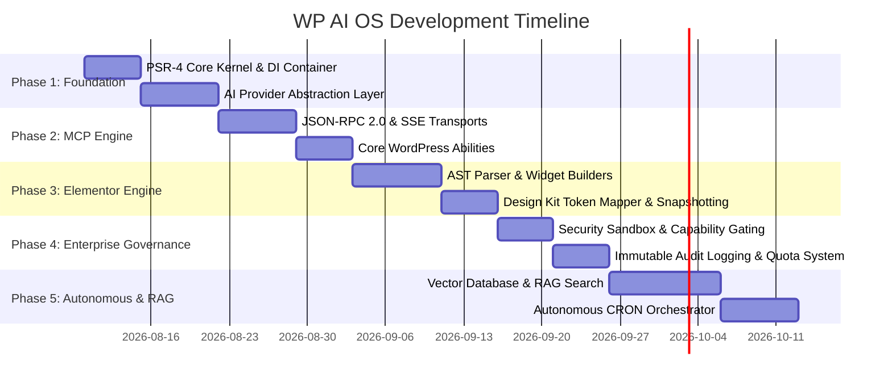

# ROADMAP.md - WP AI OS Development Roadmap

## Release Phasing & Milestone Strategy

This document outlines the multi-phase engineering roadmap for **WP AI OS**.

---

## Phase 1: Core Foundation & Provider Abstraction (Target: V0.1.0)
- [ ] Initialize repository structure with PSR-4 (`WPAIOS\`) and Composer autoloading.
- [ ] Build PSR-11 compliant Service Container (`WPAIOS\Core\Container`).
- [ ] Build internal Event Dispatcher (`WPAIOS\Core\EventDispatcher`).
- [ ] Implement standard `ProviderInterface` and data models (`Request`, `Response`, `ToolCall`).
- [ ] Build initial providers: OpenAI, Anthropic, Gemini, and Local Ollama.
- [ ] Build Provider Registry with automatic circuit-breaking and fallback routing.
- [ ] Comprehensive unit test suite for Core Container and Providers (PHPUnit + Mockery).

---

## Phase 2: MCP Engine & Base Abilities (Target: V0.2.0)
- [ ] Build MCP JSON-RPC 2.0 Request/Response Dispatcher (`WPAIOS\Mcp\Server`).
- [ ] Implement HTTP POST and SSE Transports for MCP protocol.
- [ ] Implement WP-CLI Transport (`wp ai-os mcp-server`) for local agent IDE integration.
- [ ] Implement dynamic MCP handlers: `initialize`, `tools/list`, `tools/call`, `resources/list`, `prompts/list`.
- [ ] Build dynamic Ability Registry (`WPAIOS\Abilities\AbilityRegistry`).
- [ ] Implement Core Abilities:
  - `ContentAbility` (`get_posts`, `create_post`, `update_post`, `delete_post`).
  - `MediaAbility` (`upload_media`, `inspect_attachment`).
  - `SystemAbility` (`get_system_info`, `check_health`).

---

## Phase 3: Elementor Deep Integration Engine (Target: V0.3.0)
- [ ] Build Elementor Abstract Syntax Tree (AST) parser (`WPAIOS\Elementor\Ast`).
- [ ] Implement Flexbox Container and Grid node builders (`ContainerNode`, `WidgetNode`).
- [ ] Build strongly-typed PHP builders for standard Elementor widgets (Heading, Text, Button, Image, IconBox).
- [ ] Integrate Elementor Design Kit Token Resolver (`KitTokenResolver`) to bind dynamic site styles.
- [ ] Implement automated revision snapshotting before raw meta mutations (`_elementor_data`).
- [ ] Expose Elementor Abilities to MCP engine: `wp_ai_os_inspect_elementor_layout`, `wp_ai_os_create_elementor_page`, `wp_ai_os_update_elementor_widget`.

---

## Phase 4: Enterprise Security, Governance & Audit Logging (Target: V0.4.0)
- [ ] Implement application-level authentication (JWT, WP Application Passwords, Nonce validation).
- [ ] Build Capability Guard for strict WordPress role and capability gating (`manage_options`, etc.).
- [ ] Implement Rate Limiter and Quota Manager for controlling daily/monthly token budgets per user/key.
- [ ] Build Security Sandbox for high-risk tools (destructive database calls, plugin management).
- [ ] Create immutable audit database table (`wp_ai_os_audit_log`) and logging driver (`AuditLogger`).
- [ ] PHPStan Level 8 static analysis compliance across all modules.

---

## Phase 5: Autonomous Workflows, Vector Embeddings & RAG (Target: V1.0.0)
- [ ] Implement Vector Database Abstraction (supporting Qdrant, Pinecone, or local SQLite vector storage).
- [ ] Build Content Chunking & Embedding Generator for site content (Posts, Pages, Knowledge Base).
- [ ] Build RAG (Retrieval-Augmented Generation) ability allowing agents to perform semantic search over WordPress content.
- [ ] Build Autonomous CRON Agent Orchestrator for scheduled maintenance, automated content pruning, and SEO audits.
- [ ] Multi-site network support (WordPress Multisite network-wide agent abilities).
- [ ] Official V1.0.0 Production Release.
